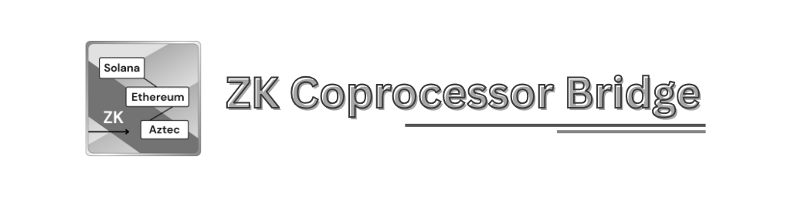
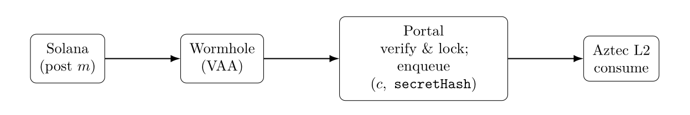

<div align="center">
  
</div>

# ZK Coprocessor Bridge 🛡️

[](LICENSE-MIT)
[](LICENSE-APACHE)
[](https://github.com/pqzk-labs/zk-coprocessor-bridge/actions/workflows/ci.yml)
[](https://doi.org/10.5281/zenodo.17409586)

**ZK Coprocessor for Solana** — a bridge enabling private ZK computations on Aztec via Ethereum and Wormhole, with replay-safe finality.  
Solana ⇄ Wormhole ⇄ Ethereum ⇄ Aztec (ZK proofs) ✅

🔬📄 **Paper:** [arXiv:2510.22536](https://arxiv.org/abs/2510.22536) • [DOI:10.5281/zenodo.17409586](https://doi.org/10.5281/zenodo.17409586)

🧾 **Latest Proof**: **Success** — end-to-end test (2025-10-11)  
Solana (devnet) → Wormhole (testnet) → Ethereum (Sepolia) → Aztec (testnet)  
Latest proof: [`proof-2025-10-11.md`](docs/proofs/proof-2025-10-11.md)    Raw logs: [`log-2025-10-11.txt`](docs/logs/log-2025-10-11.txt)

## ⚙️ What it does

<div align="center">
  
</div>

- Uses **Aztec** as a privacy coprocessor for Solana via Wormhole.
- **Forward:** Solana posts → Wormhole VAA → Sepolia Portal verifies & blocks replays → enqueues L1→L2 into Aztec Inbox → (optional) relayer consumes on Aztec.
- **Return (optional):** Portal publishes a receipt VAA; the Solana program records it.
- **Included tooling:** Anchor program, Solidity Portal, Noir contract, and TS CLI/relayers.

**Key properties**
- Replay‑safe on EVM, allowlisted chain/emitter.
- Runs today on Solana devnet, Wormhole testnet, Sepolia, Aztec testnet.

## 🌟 Key advantages

- **Cross-chain ZK** — combines Solana’s throughput, Ethereum’s security, and Aztec’s privacy layer.
- **Composability** — reuses Ethereum’s ZK ecosystem and liquidity while staying Solana-native.
- **All-in-one repo** — includes Solana program, EVM portal, Aztec contract, and relayers in one setup.

## 📂 Layout
- solana-program/ — Anchor program: post_message + record receipts  
- evm-contracts/ — Solidity: Portal (verify VAA → enqueue to Aztec Inbox)  
- aztec-contracts/ — Noir contract: consume L1→L2 message  
- apps/ — CLI & relayers (TypeScript)  

## 🚀 Quick start
> **Prereqs (suggested):** Node 24+, npm, Foundry, Anchor CLI, Solana CLI, Aztec CLI, aztec-wallet, a Sepolia account with ETH.  
> **Networks:** Solana devnet, Wormhole testnet, Ethereum Sepolia, Aztec testnet.  
> ⚠️ **Note:** Aztec is an active testnet — L1→L2 message processing or proof generation may be delayed when the explorer shows backlog. In some cases this can take several hours or a few days; Solana and Ethereum finality are unaffected.
> You can check network status and pending transactions at [AztecScan](https://testnet.aztecscan.xyz/).  

### 1. Deploy Solana program
```
cd solana-program
anchor build
anchor deploy
```
Example program id (yours will differ): `A6BL2woTfWSHHYULjqB9craU67WWPPkF8GnoJR8vG8E3`
Compute the emitter PDA (base58), then convert to 32‑byte 0x hex:

solana find-program-derived-address <PROGRAM_ID> string:emitter   # -> base58
convert base58 -> 0x<64-hex> (use your preferred snippet)
Example: `0x2e064bffb6d1f2...9816adcd`

### 2. Deploy Portal on Sepolia & set Aztec endpoints
**EVM Build:**
```
cd ../evm-contracts
forge build
```

**EVM Deploy:**
```
forge create \
  --rpc-url https://sepolia.infura.io/v3/<KEY> \
  --chain-id 11155111 \
  --account <FOUNDRY_ACCOUNT> \
  --broadcast \
  src/ZkCoprocessorPortal.sol:ZkCoprocessorPortal \
  --constructor-args \
  <WORMHOLE_CORE_ADDR> \
  <SOLANA_EMITTER_32B_HEX> \
  1 \
  <AZTEC_INBOX_ADDR> \
  <AZTEC_L2_INSTANCE_32B> \
  <ROLLUP_VERSION>
```

**EVM Configure after deploy:**
```
cast send <PORTAL_ADDR> \
  "setAztecEndpoints(address,bytes32,uint256)" \
  <AZTEC_INBOX_ADDR> <AZTEC_L2_INSTANCE_32B> <ROLLUP_VERSION> \
  --rpc-url https://sepolia.infura.io/v3/<KEY> \
  --private-key 0x<PRIVATE_KEY>
```

### 3. Deploy Aztec contract & bind portal
```
cd ../aztec-contracts/contracts/zk-coprocessor-contracts
aztec-nargo compile
aztec-postprocess-contract
ART=target/zk_coprocessor_contracts-ZkCoprocessorContracts.json
```

**Deploy on Aztec testnet (sponsored):**
```
aztec-wallet deploy "$ART" \
  --node-url https://aztec-testnet.gelato.digital \
  --from accounts:my-wallet \
  --payment method=fpc-sponsored,fpc=contracts:sponsoredfpc
```

**One-time: set the EVM Portal (20B left-padded to 32B)**
```
PORTAL_32B=0x000000000000000000000000<PORTAL_ADDR_20B_NO_PREFIX>
aztec-wallet send set_portal_once -ca last \
  --args "$PORTAL_32B" \
  --node-url https://aztec-testnet.gelato.digital \
  --from accounts:my-wallet \
  --payment method=fpc-sponsored,fpc=contracts:sponsoredfpc
```

### 4. Initialize receipt config on Solana
```
cd ../../../apps
# Requires: SOLANA_PROGRAM_ID, SOLANA_PAYER_KEYPAIR, PORTAL_ADDRESS
npx tsx src/init_receipt_config.ts
```
### 5. Send a message & run relayers
```
# Post a Wormhole message from Solana:
npm run send --prefix ./apps -- --payload "hello aztec!"

# Forward relayer: fetch VAA → Portal.consumeWithSecret → Aztec consume
npm run relayer --prefix ./apps

# Receipt relayer (optional): record completion on Solana
npm run relayer --prefix ./apps -- --job receipt
```

## ⚖️ License
This project is dual-licensed under either:

- MIT License (see LICENSE-MIT)
- Apache License, Version 2.0 (see LICENSE-APACHE)

at your option.  
