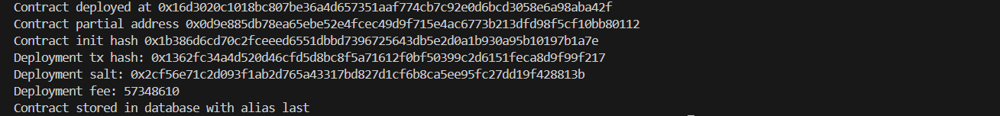
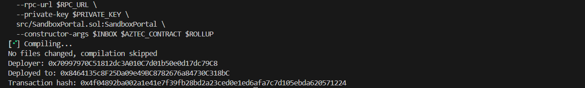
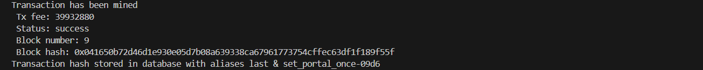
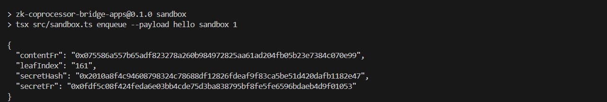
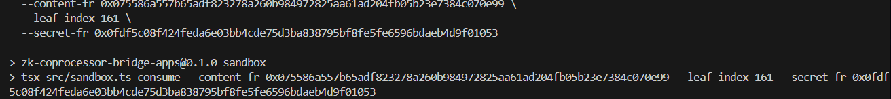

# Proof — 2025-11-19 (Aztec Sandbox)
L1 → Portal → Aztec Inbox → Noir contract (consume_from_inbox) in local sandbox.  
**Status:** ✅ Success  

Sandbox Test Docs ⚙️: [`sandbox.md`](../sandbox.md)   Raw logs: [`log-2025-11-19.txt`](../logs/log-2025-11-19.txt)

- **Aztec Contract Deployment**
```
aztec-wallet deploy target/zk-coprocessor-contracts.json \
  --from accounts:test0 \
  --payment method=fee_juice,feePayer=test0
```
<div align="center">
  
</div>


- **Portal Deployment**
```
forge create --broadcast \
  --rpc-url http://host.docker.internal:8545 \
  --private-key <key> \
  src/SandboxPortal.sol:SandboxPortal \
  --constructor-args <INBOX> <AZTEC_CONTRACT> <ROLLUP>
```
<div align="center">
  
</div>


- **Portal Registered on Aztec**
```
aztec-wallet send set_portal_once \
  -ca $AZTEC_CONTRACT \
  --args <PORTAL_32B> \
  --from accounts:test0 \
  --payment method=fee_juice,feePayer=test0
```
<div align="center">
  
</div>


- **enqueue (L1 → L2 Message)**
```
npm run sandbox -- enqueue --payload "hello sandbox"
```
<div align="center">
  
</div>


- **consume_from_inbox (L2)**
```
npm run sandbox -- consume \
  --content-fr <contentFr> \
  --leaf-index <leafIndex> \
  --secret-fr <secretFr>
```
<div align="center">
  
</div>
